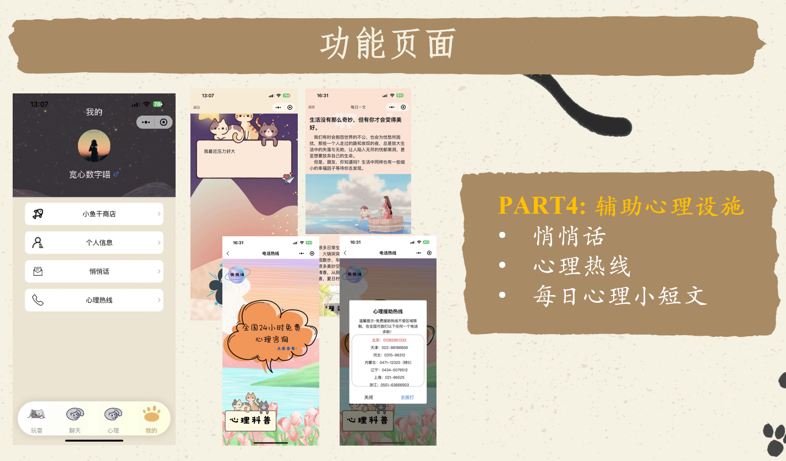

# 规划与梳理项目负责技术模块

> 日期：2024/12/19
>
> 汇报人：叶晓良

---

---

## 项目技术块需求

### 项目理念

随着人工智能技术的快速发展，特别是在自然语言处理、情感分析、机器学习等领域的进步，AI心理咨询辅助工具在技术上已变得更加成熟和可靠，同时有多个开源模型可以支持这些技术的应用和发展。

- **自然语言处理（NLP）**：NLP是AI心理咨询的核心技术之一。它允许计算机理解、解释和生成人类语言。在心理咨询中，NLP可以用于分析用户的语言，识别情感状态、压力水平和可能的心理健康问题。开源模型如Google的BERT和OpenAI的GPT系列在语言理解和生成方面表现出色，适合用于构建心理咨询应用。
- **情感分析**：情感分析是NLP的一个分支，专注于识别和分类文本中的情感倾向。在心理咨询应用中，情感分析可用于监测用户的情绪变化，从而提供更加个性化的反馈和建议。一些开源模型，如DeepMoji，可以识别文本中的情感状态。
- **机器学习和数据挖掘**：机器学习技术使系统能够通过分析大量数据来识别模式和做出决策。在心理咨询中，这可以用于识别可能的心理健康问题的早期迹象，优化咨询过程。开源机器学习库如TensorFlow和Scikit-learn可用于开发这些功能。
- **对话系统和聊天机器人**：对话系统允许AI以自然方式与用户进行交流。在心理咨询中，AI聊天机器人可以提供初步咨询、心理健康教育和情绪支持。开源工具如Rasa和Microsoft Bot Framework可以用于构建这些交互式对话系统。
- **语音识别和生成**：语音技术使AI可以通过听取和模拟语音与用户互动，为那些更愿意通过说话而非写作来表达自己的用户提供方便。开源工具如Mozilla的DeepSpeech可以实现语音识别功能。
- **用户行为分析**：通过追踪和分析用户在应用中的行为，AI可以提供更加定制化的建议和干预。这需要复杂的数据分析和模式识别技术，一些开源数据分析工具如Pandas和NumPy可以在此发挥作用。

从用户提供的<u>与逝者及用户本人相关的文本、音视频资料或诉说回忆的材料</u>出发，将基础象征物通过对人脸信息的深度建模及用户喜好，定制生成符合用户需求的可视的象征化“伙伴”（如恐龙、太阳等），通过深度学习的自然语言处理技术实现与“伙伴”的交流，以情感建模和语音合成提升与“伙伴”的沟通质量。

哀伤疗愈的全过程，都采用**象征化、具象化、仪式化**处理。

1. 开始阶段，让用户选择逝者在其体象中代表的部位（如心脏），将其剪影从全身的总体剪影中取出；
2. 让用户选择自己喜欢的能够代表逝者的基础象征物（由于逝者与用户之间的依恋强度与距离各不相同，因此提供不同类型的选择，如动物、日用品、太阳、云层等），将最开始取出的身体部位变化成基础象征物，同时让用户输入有关自己、逝者、对逝者的认知、共享事件等信息，将基础象征物逐渐完善新生成的人物画像；
3. 在疗愈的终点，象征物变回用户取出的身体部位（但颜色由最初的空白变为彩色），放回其残缺的虚拟身体轮廓中。整个流程向用户表明：你在于由自身与逝者信息结合所构筑出的独立的虚拟生命进行交互，从而修复你与逝者联结的那部分自我。

AI伙伴随着用户自我成长与疗愈阶段的发展，<u>向用户布置不同任务</u>，AI伙伴以“<u>反向生长</u>”的形式，逐渐退化到最终消失，构建一场有始有终的疗愈仪式，帮助丧亲者逐渐将疗愈重心从AI辅助转向自主的社会生活，完成自我的重塑。

通过不同方式帮助用户更稳定地将其与逝者地依恋由外部依恋转向内部依恋，并促进用户在此过程中的自我成长。

1. 在疗愈过程中，象征物会随着实时评估决定是否进入下一个阶段，每个阶段象征物会有不同的倒退形态（如象征物是恐龙，则恐龙在不同阶段逐渐变小变可爱，最终成为一个恐龙蛋），逐渐减少逝者在AI中的相对信息含量，并时刻提醒用户这段即将结束的旅程。最后象征物变成蛋后，向用户发送蛋的线下礼品，蛋里装着象征物的形象，用奖励抵消用户因为象征物退化而减弱的使用动机，并在其心中构筑完成这一段疗愈的纪念；
2. 让用户在不同阶段完成不同的任务（任务形式包括<u>与AI对话、自我对话、运动打卡、艺术创造、同质群体交流、线下公益活动</u>等），领取虚拟奖励并解锁新的界面。例如初期重心放在与AI的对话以及信息输入（如每当产生悲哀、内疚等情绪时，向AI倾诉记录下当时的感受，或是写日记等），并有意识地引导用户运用积极的叙事架构进行表达；中期重心偏向表达性艺术治疗（如设计象征物所处的环境背景、挑选新歌作为每日的主题曲等）；后期则以帮助用户重回社会为主要目标，逐渐在任务中增加现实生活的成分与自我的成分，鼓励用户慢慢在全新的现实生活中找到意义感，并减少前期与AI对话的任务，从外部对话逐渐转为用户的内部对话。为防止沉迷与依赖，为AI象征物设定睡眠并使之每日只能使用一个小时。

提供社群功能，使用户可以以AI伙伴的形象进行线上社交；同时与专业机构联动发布有疗愈功能的团体公益任务。

<u>同质群体支持与公益活动</u>是哀伤疗愈最有效的两种方式，前者在于为用户构建可以真正相互共情的群体氛围以缓解其孤独感，后者则在于重塑用户因为丧失事件被压抑的自尊与价值感。项目组将用app为丧失群体构建线上社区，在任务中加入交互活动，让用户以象征物的身份进行互动（如进入自己设计的场景一起散心、野餐，给与鼓励、倾听，互送小礼物等）；或通过公益组织发布群体任务，号召丧失群体去为其他边缘群体提供帮助，远期为丧失人群与其他边缘群体构建全国层面的互助网络。

### AI模型

#### 基本模块逻辑

技术逻辑：

1. 大语言预训练模型：大语言模型，例如ChatGPT、Gemini、Claude可以一定程度上理解用户输入的语言，拥有基础逻辑推理能力，具备基于常识的“经验式”回答能力，因此我们将借助这类模型特点，作为我们模型基座。
2. 微调技术：由于大语言模型是基于全行业全渠道的数据进行训练，它可以对大多数常识内容进行分析回答，但是对于深度专业的领域的能力是不足的，因此我们可以借助心理学领域的知识对大语言模型进行二次微调，以获得更好的专业效果
3. 向量数据库：针对专业垂直领域，向量数据库可以将行业知识存储为向量，在用户提问时可以通过向量对比来从向量数据库中抽取相关度高的专业信息条文作为上下文参与整轮对话。

AI生成过程：

1. 获取心理行业数据，例如论文，实验案例等内容，整理为数据集，对llama等类似开源大模型进行微调。
2. 将行业信息通过Embedding导入向量数据库等待查询。
3. 用户输入内容，从向量数据库中抽取相似度最高的信息，与用户输入的内容作为上下文填入Prompt中并输入微调后的心理大模型以获得最终的信息
4. 记录用户输入的内容及回答于向量数据库，形成专属个体的特征向量数据库，以在将来再次调取，来获得更全面的诊疗意见

#### 声音模拟生成

技术逻辑：

1. **语音合成技术：** 使用深度学习模型，如SoVITS、WaveNet、Tacotron等，来生成自然流畅的语音。
2. **情感和语调模型：** 整合情感分析和语调模型，以便根据文本的语气和情感生成相应的声音特征。
3. **声纹合成：** 利用声纹识别技术，使生成的语音更加贴近原始说话者的声音特征。

AI生成过程：

1. **文本输入：** 用户提供待生成语音的文本。
2. **情感分析：** 确定文本的情感色彩，以调整语音的表达方式。
3. **语音合成：** 使用深度学习模型生成自然语音，考虑语调和声纹合成技术。
4. **输出语音：** 将生成的语音以音频文件形式呈现。

#### 说话风格兴趣爱好模拟对话

技术逻辑：

1. **自然语言处理（NLP）：** 使用预训练的语言模型，如文心一言、华为盘古、讯飞星火、Gemini、Claude、GPT-3.5等模型，理解和生成与兴趣爱好相关的对话。
2. **对话管理：** 利用对话管理系统确保连贯性和上下文的正确理解，以更自然地模拟真实对话。
3. **兴趣爱好数据库：** 整合兴趣爱好相关信息到向量数据库中，通过对对话进行Embedding向量化对比提取，使得AI能够对特定话题进行更有个体特色的讨论。

AI生成过程：

1. **对话开始：** 用户提出问题或引导对话。
2. **语境理解：** AI通过NLP理解用户输入的语境，提取关键信息。
3. **生成回应：** 利用预训练模型，生成与兴趣爱好相关的自然语言回应。
4. **上下文维护：** 对话管理系统维护上下文，确保回应连贯性和合理性。
5. **输出对话：** 将生成的对话文本返回给用户。

#### 视频综合输出能力

技术逻辑：

1. **个性特征提取：**通过数据分析、社交媒体信息或用户提供的问卷等方式，获取个体的性格特点、兴趣爱好、行为习惯等信息。
2. **情感建模：**使用情感分析技术，从用户的文字、图片或社交媒体内容中提取情感信息，以理解个体的情感状态。
3. **模型训练：**利用深度学习模型，如生成对抗网络（GANs）或变分自动编码器（VAEs），训练一个能够生成个性化视频的模型。
4. **上下文关联：**考虑生成视频的上下文，确保视频中的内容与用户的个性和情感状态相一致。
5. **动态生成：**结合用户的行为习惯，使得生成的视频更加动态和个性化。这可能涉及到模拟用户在不同场景下的行为反应或添加用户喜好的活动元素。

AI生成过程：

1. **用户输入：** 用户提供个性特点、行为习惯等信息，或者允许AI访问相应的数据源。
2. **特征提取和情感分析：** 对用户提供的信息进行处理，提取个性特点和进行情感分析。
3. **视频生成：** 利用训练好的深度学习模型，动态生成符合用户特点和情感状态的视频。
4. **语音对话：**结合上面对话及生成模仿声音两个能力，实现视频实时对话。

### UI设计

感觉和我之前有个学长做的小程序有点相像，此处提供一下他们的UI界面，可以作为参考。如果比较感兴趣，我这里有学长汇报时的PPT，里面有项目AI部分具体实现过程。

---

## 具体负责工作

### 1. 辅助UI设计

辅助UI设计人员进行UI页面的设计，提供完备性和可行性建议。保证UI设计全面，覆盖所有的页面以及细节设计；给出开发端对于页面设计难度程度的评估，保证UI在规定的工期内可以实现。

### 2. 辅助AI模型训练

我对AI模型训练了解比较少，之前只做过预训练模型的LoRA微调训练，但是做的只是LLM，对于多模态模型了解不多，Embedding技术和向量数据库有所了解，但是确实没用过。更多的可以边学边辅助AI模型训练。

### 3. 安卓端开发

完成咨询师端、来访者端的APP设计开发。

### 4. Java后端开发

完成咨询师端、来访者端软件所需的后端接口开发，包括AI模型接入、数据库管理、云服务器部署与管理等等。

